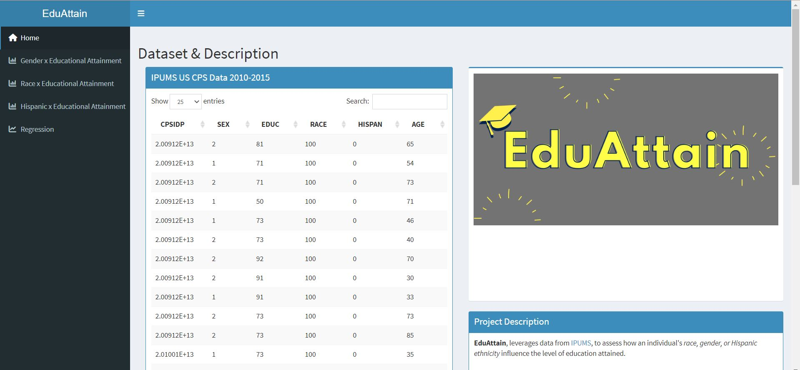
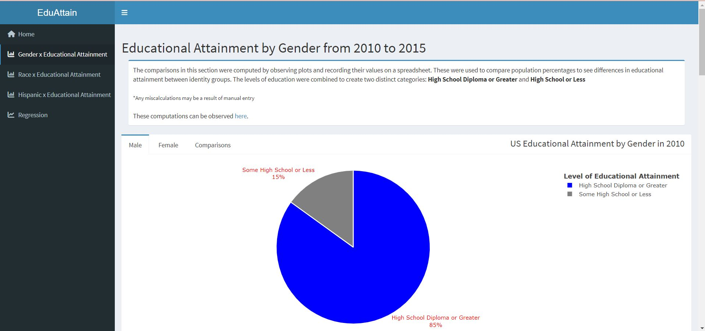
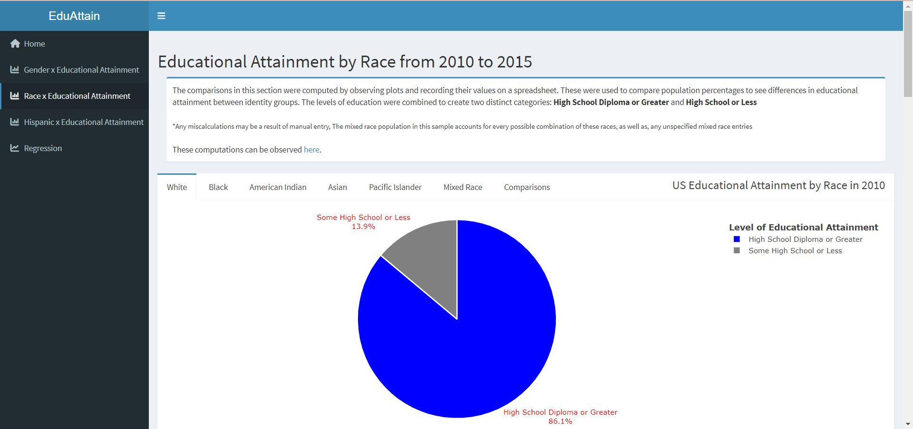
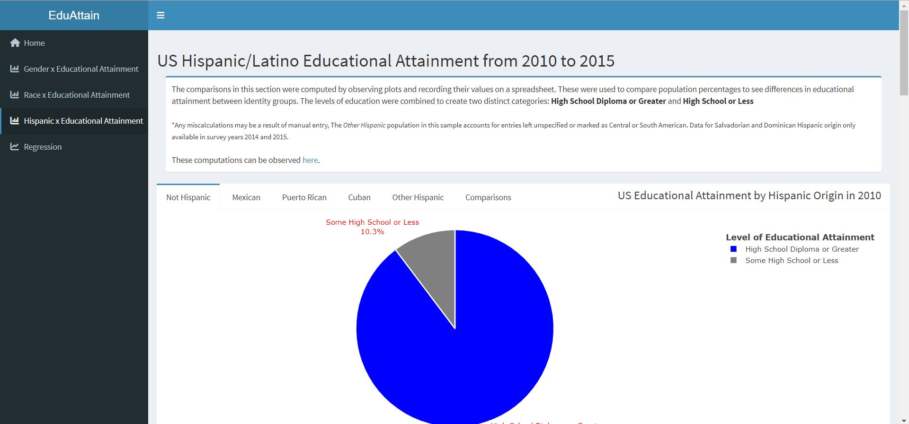
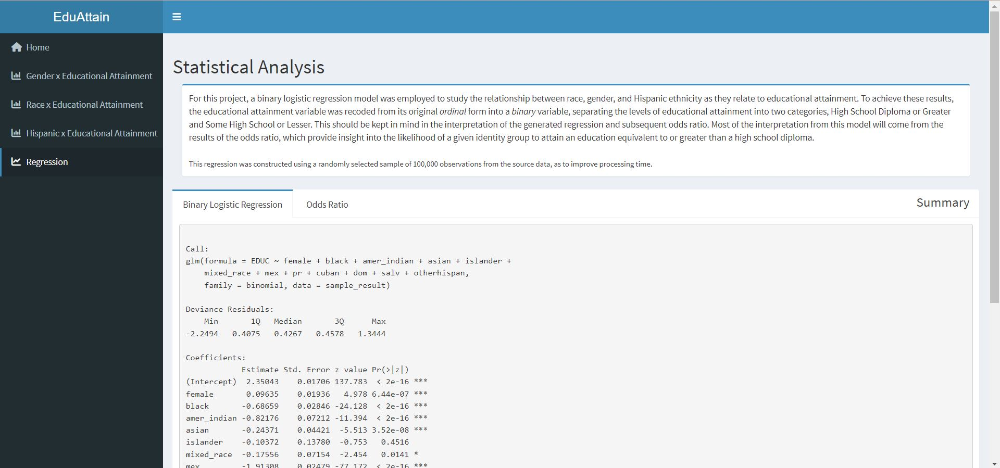

# EduAttain: A Statistical Analysis of the Impact of Different Demographic Indicators on Educational Attainment

   

## Table of Contents

1. [Abstract](#abstract)
2. [Technical Details](#technical-details)
3. [Installation](#installation)
4. [Structure](#structure)
5. [Usage](#usage)
6. [Results](#results)

## Abstract

Over the last fifty years, trends in educational attainment have reflected simultaneous movements towards closing and widening disparities between different identity groups. Studying educational attainment, specifically revolved around studying disparities in education, is vital because of the implications for future work opportunities, financial security, and resource access. **EduAttain** identifies and investigates the role certain demographic factors play as determinants of educational attainment, namely, sex, race, and Hispanic ethnicity. Leveraging data from *IPUMS*, and using *R*, *R Shiny*, and *SQLite*, trends in educational attainment across different identity groups are studied through the use of pie charts to display results and draw comparisons displayed on a **[web-based dashboard](https://donizk.shinyapps.io/EduAttain/)**. The statistical relationship between these factors and educational attainment are studied using a *binary logistic regression*, to determine what populations had a higher odds of having a high school diploma or greater. The findings of this project affirm some of the findings presented in the literature, while providing new insight into certain racial groups' and Hispanic ethnic subgroups' rates of educational attainment. In general, the highest attaining populations in educational attainment were the White, Non Hispanic, and Female populations, compared to all other respective identity groups. Within the Hispanic ethnic group, the Cuban population maintained the highest level of educational attainment, relative to all other Hispanic ethnic subgroups. Furthermore, these results establish that the *Human Capital Model* fails to consider certain aspects of identity that may greatly influence the level of education an individual attains, outside of the influence of income and financial investments into education.

## Technical Details

**EduAttain** was developed using the following tools and packages.
        - *R*: data cleaning and manipulations, visualizations, & statistical analysis
        - *RStudio*: main IDE
        - *SQLite*: database storage for data source
        - *R packages*
                - *tidyverse* & *dplyr*: data manipulation
                - *shiny* & *shinydashboard*: dashboard creation
                - *plotly*: visualization generation
                - *RSQLite*: connects SQLite and R together
                - *rsconnect*: connects Shiny apps & dashboards to Shinyapps.io to be deployed and hosted online

## Installation

This project does not require a prior install before usage and can be accessed using the [web-based platform](https://donizk.shinyapps.io/EduAttain/), deployed on [shinyapps.io](https://www.shinyapps.io/).

For those who would like to install the project files for use on a local machine, the following steps will need to be taken to support the usage of the application:

1. Install the source files from this GitHub Repository by clicking the **Code** button and selecting the **Download Zip** option.
2. Ensure you have a working installation of R and R Studio.
3. Extract the files from the zipped file on your local machine.

## Structure

The structure of the files contributing to the development of EduAttain are as follows:

- `EduAttain` folder: contains the main code file for this project, `app.R`, and the corresponding `description` configuration file. This folder also contains the following folders, all of which contain pertinent information for the project:
  - `data` folder: contains the data source for this project, `CPS.db`.
  - `tests` folder: contains the test file for this project, `app_tests.R`.
  - `www` folder: contains the picture files used in the project
- `files` folder: contains the `database.sql` code file used to create the SQLite database housing the data for this project, as well as, pictures used in the README.

## Usage

Read along to learn more about the [Local Usage](local-usage), [Web Usage](web-usage), and [Expected Output](expected-output) of EduAttain.

### Local Usage

To use EduAttain locally using the source files mentioned in the [Installation](#installation) section, the following steps must be taken:

1. Traverse the installed, extracted directory within your local machine's file directory ( which should be named *EduAttain*) for the **EduAttain/app.R** file.
2. Open the **EduAttain/app.R** file in RStudio.
3. Run the application using the IDE's run button or by typing in the following command to the RStudio console: `runApp('path/to/file/EduAttain/EduAttain')`
4. If the application is running successfully, a separate browser or RStudio application window should open, displaying an application similar to that documented in [Expected Output](#expected-output)

### Web Usage

For general access and use of EduAttain, without having to go through the process of local installation, the [dashboard application](https://donizk.shinyapps.io/EduAttain/) is hosted on shinyapps.io.

### Expected Output

EduAttain is a comprehensive data analysis dashboard studying educational attainment as it relates to gender, race, and Hispanic Ethnicity, sectioned off into two main sections: *Descriptive Statistics* and *Statistical Analysis*.

The structure of the dashboard is as follows:

- **Data & Description**: This page of the dashboard presents a table of the raw data set extracted from IPUMS, summary statistics relating to the age and amount of individuals captured in the data, project description, and a data key for the data table.

- **Gender x Educational Attainment**: This page of the dashboard presents pie charts that were generated for each survey year representing the proportion of each gender's population above or below a High School education, and interpretations of the plots that compare female and male educational attainment.

- **Race x Educational Attainment**: This page of the dashboard presents pie charts that were generated for each survey year representing the proportion of each racial population above or below a High School education, and interpretations of the plots that compare White, Black, Asian, American Indian, Pacific Islander, and Mixed Race educational attainment.

- **Hispanic x Educational Attainment**: This page of the dashboard presents pie charts that were generated for each survey year representing the proportion of each Hispanic population above or below a High School education, and interpretations of the plots that compare Non Hispanic, Mexican, Puerto Rican, Cuban, Other Hispanic, Dominican, and Salvadorian educational attainment.

- **Regression**: This page of the dashboard presents the results of the binary logistic regression and corresponding odds ratio, along with interpretations from these figures.

The Gender x Educational Attainment, Race x Educational Attainment, and Hispanic x Educational Attainment fall under the Descriptive Statistics section, where plotly pie charts based on population percentages depict how educational attainment varies by race, gender, and Hispanic ethnicity over each survey year.

The Regression section of the dashboard falls within the Statistical Analysis section, where the statistical relationship between educational attainment and each of the explanatory variables was tested using a binary logistic regression.

## Results

Within the **descriptive statistics** section, the results from observing population percentages from the plots are as follows.
- *Gender and Educational Attainment*:
  - The **female** population had the highest proportion of individuals with a completed high school education or greater.
- *Race and Educational Attainment*:
  - The **Asian** population had the highest proportion of individuals with a completed high school education or greater followed closely by the Mixed Race, White, & Pacific Islander populations. The lowest attaining populations were the Black and American Indian populations, in order.
- *Hispanic Ethnicity and Educational Attainment*:
  - The **Non Hispanic** population had the highest proportion of individuals with a completed high school education or greater.
    - Within the Hispanic ethnic group, the **Cuban** population had the highest proportion of high school and college educated individuals, followed by the attainment of the Puerto Rican, Other Hispanic, Dominican, Mexican, and Salvadoran populations, in order.

Within the **statistical analysis** section, the results from the binary logistic regressions, odds ratios, and confusion matrices are as follows.

- *First Binary Logistic Regression, Accuracy, & Odds Ratio*
  - All gender, race, and Hispanic ethnicity variables are ***statistically significant*** in relation to educational attainment.
  - The first binary logistic regression had an accuracy of ****, based on the results of the confusion matrix.
  - *Odds Ratio*
        - *Gender and Educational Attainment*: **Women** have a higher odds of completing an education greater than or equivalent to a high school diploma.
        - *Race and Educational Attainment*: The **White** population has a higher odds of completing an education greater than or equivalent to a high school diploma. All other racial groups have a lower odds of attaining this level of education, albeit at varying levels.
        - *Hispanic Ethnicity and Educational Attainment*: The **Hispanic** subgroups accounted for in the regression all have a lower odds of completing high school or college relative to the Non-Hispanic group.
- *Second Binary Logistic Regression, Accuracy, & Odds Ratio*
  - The Hispanic ethnicity variable and all other race and gender variables are ***statistically significant*** in relation to educational attainment.
  - The second binary logistic regression had an accuracy of ****, based on the results of the confusion matrix.
  - *Odds Ratio*
    - *Gender and Educational Attainment*: **Women** have a higher odds of completing an education greater than or equivalent to a high school diploma.
    - *Race, Hispanic Ethnicity, and Educational Attainment*: The **White, Non Hispanic** population has a higher odds of completing an education greater than or equivalent to a high school diploma. All other racial groups have a lower odds of attaining this level of education, albeit at varying levels.
      - The population with the lowest odds of completing a high school or college education was the **Hispanic** ethnic group.

Review the [final report](https://github.com/ReadyResearchers/cmpsc-600-fall-2022-and-spring-2023-senior-thesis-donizk/releases/download/senior_thesis-donizk-2.0.2/SeniorThesis.pdf), based on the development and findings of EduAttain.
